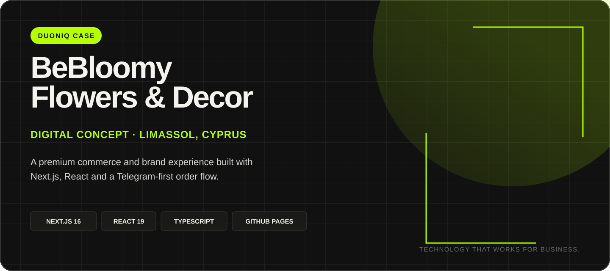
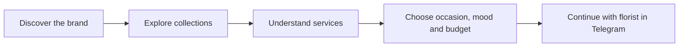
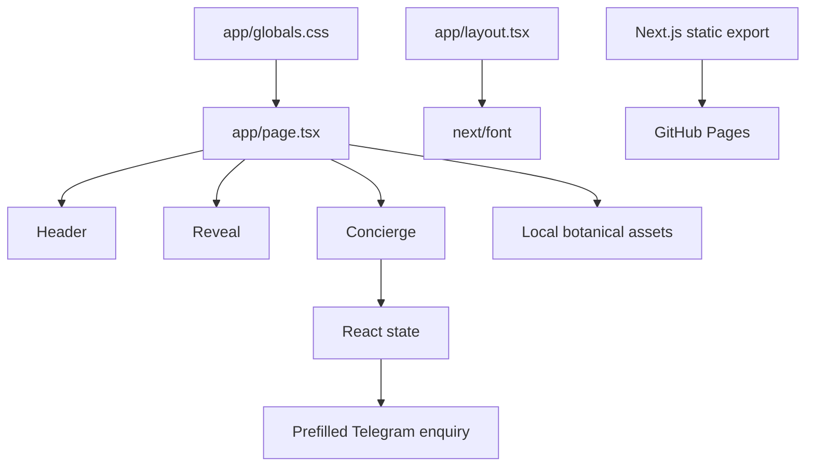

<p align="center">
  
</p>

<p align="center">
  <a href="https://richmanstudio.github.io/Duoniq-BeBloomy-Website/"><strong>VIEW LIVE CONCEPT</strong></a>
  &nbsp;&nbsp;·&nbsp;&nbsp;
  <a href="#local-development"><strong>RUN LOCALLY</strong></a>
  &nbsp;&nbsp;·&nbsp;&nbsp;
  <a href="#project-structure"><strong>EXPLORE THE CODE</strong></a>
</p>

<p align="center">
  
  
  
  
</p>

---

## PROJECT OVERVIEW

**BeBloomy Flowers & Decor** is a presentation-ready digital concept created by **DUONIQ** for a floral boutique in Limassol, Cyprus.

The project turns a social-first customer journey into a clear branded experience: visitors discover the studio, explore its services, define the mood and budget for an arrangement, and continue the order directly with the florist in Telegram.

> **From business need to working product.**  
> A focused digital experience designed to strengthen presentation, trust and customer enquiries.

## BUSINESS TASK

The concept was built around four practical goals:

| 01 | 02 | 03 | 04 |
|---|---|---|---|
| Present BeBloomy as a refined local brand | Explain services without overloading the visitor | Turn interest into a structured order brief | Keep personal communication through Telegram |

## EXPERIENCE FLOW



## WHAT WAS DESIGNED

- Editorial landing experience with a strong visual hierarchy
- Responsive navigation and full-screen mobile menu
- Seasonal collection presentation
- Services for bouquets, events, interiors and gifting
- Event-focused visual section
- Brand story and boutique information
- Interactive flower concierge
- Telegram-first enquiry flow with a prefilled customer brief
- Static production export for GitHub Pages
- Accessibility and reduced-motion support

## PRODUCT HIGHLIGHTS

<table>
  <tr>
    <td width="50%" valign="top">
      <strong>PERSONAL FLOWER CONCIERGE</strong><br/><br/>
      Customers choose an occasion, visual mood and comfortable budget. The website converts those choices into a structured Telegram message for the florist.
    </td>
    <td width="50%" valign="top">
      <strong>EDITORIAL BRAND SYSTEM</strong><br/><br/>
      Large-format typography, restrained motion, botanical artwork and a warm natural palette create a consistent premium presentation without distracting from the offer.
    </td>
  </tr>
  <tr>
    <td width="50%" valign="top">
      <strong>MOBILE-FIRST CUSTOMER JOURNEY</strong><br/><br/>
      Navigation, collection cards, service rows and the concierge interface are adapted for compact screens and touch interaction.
    </td>
    <td width="50%" valign="top">
      <strong>STATIC, PORTABLE DELIVERY</strong><br/><br/>
      The application exports as static files and can be deployed through GitHub Pages or moved to another hosting environment.
    </td>
  </tr>
</table>

## DESIGN SYSTEM

| Token | Value | Role |
|---|---|---|
| Neon Lime | `#B6FF00` | DUONIQ project accents and actions |
| Graphite | `#111111` | Documentation and presentation foundation |
| Forest | `#173528` | BeBloomy primary brand surface |
| Milk White | `#F4F3EE` | Main light background |
| Wine | `#5D2938` | Emotional accent and concierge action |
| Display type | Cormorant Garamond | Editorial headings |
| Interface type | Manrope | Navigation, controls and body copy |

## TECHNOLOGY

| Layer | Technology |
|---|---|
| Framework | Next.js 16.2 — App Router |
| Interface | React 19.2 |
| Language | TypeScript 5.9 |
| Styling | Custom responsive CSS |
| Typography | `next/font` with Cormorant Garamond and Manrope |
| Interaction | React state, Intersection Observer and Telegram deep links |
| Output | Static export |
| Deployment | GitHub Actions and GitHub Pages |

## ARCHITECTURE



## LOCAL DEVELOPMENT

Requirements:

- Node.js 20 or newer
- npm
- Git

```bash
# Clone the repository
git clone https://github.com/richmanstudio/Duoniq-BeBloomy-Website.git

# Enter the project
cd Duoniq-BeBloomy-Website

# Install dependencies
npm install

# Start the development server
npm run dev
```

Open `http://localhost:3000`.

## PRODUCTION BUILD

```bash
npm run build
```

The static production output is generated in `out/`.

## DEPLOYMENT

The repository includes a GitHub Actions workflow for static deployment from `main`.

Repository configuration:

1. Open **Settings**
2. Open **Pages**
3. Set **Source** to **GitHub Actions**
4. Push changes to `main`

Expected project URL:

```text
https://richmanstudio.github.io/Duoniq-BeBloomy-Website/
```

## PROJECT STRUCTURE

```text
Duoniq-BeBloomy-Website/
├── app/
│   ├── globals.css          # Responsive design system and layouts
│   ├── layout.tsx           # Metadata and local font configuration
│   └── page.tsx             # Main presentation experience
├── components/
│   ├── Concierge.tsx        # Interactive order brief
│   ├── Header.tsx           # Desktop and mobile navigation
│   ├── LeafMark.tsx         # BeBloomy botanical mark
│   └── Reveal.tsx           # Motion-aware reveal system
├── docs/
│   └── readme-cover.svg     # DUONIQ repository cover
├── public/
│   └── images/              # Local editorial artwork
├── next.config.ts           # Static export and GitHub Pages paths
└── package.json
```

## CONCEPT STATUS

The presentation build is complete and ready for client review.

Before commercial launch, the following items must be confirmed with BeBloomy:

- Final product catalogue and pricing
- Original production photography
- Delivery zones and order policies
- Legal and privacy documents
- Payment or checkout requirements
- Final contact details and multilingual scope

---

<table>
  <tr>
    <td width="70%" valign="middle">
      <strong>DUONIQ</strong><br/>
      Technology that works for business.<br/>
      We build digital products that help businesses grow.
    </td>
    <td width="30%" align="right" valign="middle">
      <a href="https://richmanstudio.github.io/richmanstudio/"><strong>BUILD WITH DUONIQ ↗</strong></a>
    </td>
  </tr>
</table>
